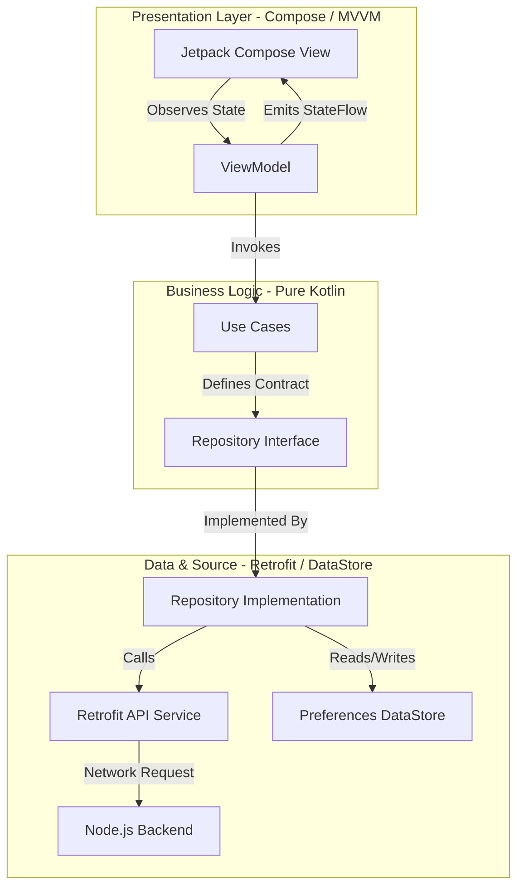
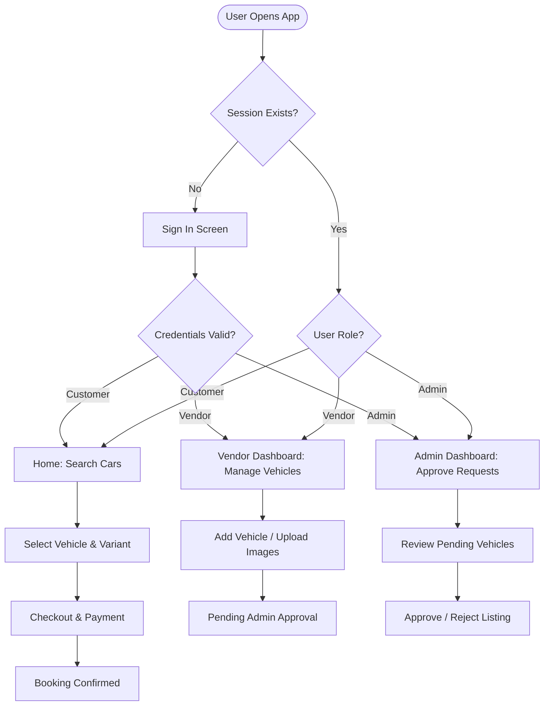

# Rent-a-Ride 🚗💨

[](https://kotlinlang.org/)
[](https://developer.android.com/jetpack/compose)
[](https://m3.material.io/)
[](https://developer.android.com/training/dependency-injection/hilt-android)
[](https://square.github.io/retrofit/)
[](https://nodejs.org/)
[](https://www.mongodb.com/)

Rent-a-Ride is a complete, production-ready full-stack vehicle rental platform. The platform features a native Android application built in Kotlin using Jetpack Compose, backed by a robust Node.js and Express.js REST API backend. It leverages MongoDB for persistent database storage and Cloudinary for media hosting, delivering a seamless experience for customers, vendors, and administrators.

---

## 📖 Project Overview

### The Problem
Traditional car rental applications often suffer from lagging user interfaces, complex booking configurations, and a lack of clear separation between customer actions, vendor listings, and administrative oversight. Rent-a-Ride addresses this by providing a unified, high-performance system consisting of:
* A native **Android Application** engineered with a modern Material 3 design system, responsive layouts, and smooth micro-animations.
* A scalable **REST API Backend** that enforces secure authentication, manages data transactions, and handles role-based business rules.

### Key Workflows
* **Customers** can find, filter, and book rides seamlessly.
* **Vendors** can manage their fleet, upload multiple vehicle images, and monitor bookings.
* **Administrators** can moderate vehicle listings, approve vendor vehicles, and manage the booking catalog.

---

## 📸 Screenshots

*Below are placeholders for the application UI screens. These will display the Material 3 components in action.*

| Customer Login | Home Dashboard | Search & Filters |
| :---: | :---: | :---: |
| `[Screenshot: Customer Login]` | `[Screenshot: Home Dashboard]` | `[Screenshot: Search & Filters]` |

| Search Results | Vehicle Details | Checkout & Payment |
| :---: | :---: | :---: |
| `[Screenshot: Search Results]` | `[Screenshot: Vehicle Details]` | `[Screenshot: Checkout & Payment]` |

| Booking History | Vendor Dashboard | Admin Controls |
| :---: | :---: | :---: |
| `[Screenshot: Booking History]` | `[Screenshot: Vendor Dashboard]` | `[Screenshot: Admin Panel]` |

---

## ⚡ Features

### 👤 Customer Module
* **Authentication:** Secure email/password login, registration, and automatic session restoration.
* **Search Widget:** Pick-up/Drop-off location dropdowns, validation checking, and interactive date/time pickers.
* **Vehicle Catalog:** Browsing by categories (SUVs, Sedans, Luxury, EVs) with dynamic pricing details.
* **Vehicle Details:** Detailed specifications (seats, transmission, engine type), location mapping, and image slider.
* **Checkout & Razorpay:** Rent pricing calculation with integrated Razorpay payment gateway flow.
* **Booking History:** Tabbed view of bookings categorized by state (Active, Completed, Cancelled).
* **Favorites/Wishlist:** Native empty state indicator for saved vehicles.
* **Profile Management:** Edit profile fields (Name, Phone, Address) with direct backend synchronization.

### 🏢 Vendor Module
* **Vendor Authentication:** Dedicated registration and login screens for vendor accounts.
* **Dashboard:** Unified control center displaying vehicle fleets, approval metrics, and active listings.
* **Vehicle Fleet CRUD:** 
  * Add new vehicles with comprehensive details (Brand, Model, Seats, Price, Fuel, Transmission, and Location).
  * Multipart multiple-image upload support.
  * Edit vehicle listings.
  * Delete/Deactivate listings.
* **Approval Status Tracking:** Live tracking of approval states (`Pending`, `Approved`, `Rejected`) assigned by the platform administrator.
* **Vendor Bookings:** Monitor customer bookings tied to vendor vehicles.

### 👑 Admin Module
* **Role-Based Authentication:** Automatic redirection to the Admin Panel upon signing in with admin credentials.
* **Approval Queue:** Moderate vehicle requests submitted by vendors (Approve or Reject).
* **Vehicle Catalog Management:** Monitor the platform's approved vehicle catalog and remove listings.
* **Booking Moderation:** 
  * List all active bookings across the entire platform.
  * Dynamically update booking states (e.g., mark as Completed, Trip Started, Overdue, or Cancelled).

---

## 🏛️ Architecture

### Android Application
The Android project strictly adheres to **Clean Architecture** and the **MVVM (Model-View-ViewModel)** design pattern. It enforces a unidirectional data flow and clean separation of concerns across three main layers:



* **Presentation Layer:** Jetpack Compose for declarative UI, using custom Material 3 components. ViewModels manage UI state using `StateFlow` and handle lifecycle-aware operations.
* **Domain Layer:** Contains domain entities, business logic, and repository interfaces. Built with pure Kotlin, this layer has zero dependency on framework code.
* **Data Layer:** Manages data access. It implements the Repository interfaces, performs Retrofit network operations, maps DTOs to domain objects, and handles session caching via Jetpack Preferences DataStore.

### Backend Server
The server-side backend follows the **MVC (Model-View-Controller)** pattern. It features Express.js routers that direct incoming HTTP request payloads to controller classes, which interact with MongoDB database models using Mongoose schemas.

---

## 🛠️ Tech Stack

### Android Frontend
* **Kotlin:** Main programming language.
* **Jetpack Compose:** Declarative UI toolkit.
* **Material 3:** Modern design system styling.
* **Dagger Hilt:** Dependency Injection framework.
* **Retrofit & OkHttp:** API client networking layer.
* **Coroutines & Flow:** Reactive data streams and concurrent programming.
* **Coil:** Image loading library for async image processing.
* **Jetpack DataStore:** Persistent session caching.
* **Razorpay Android SDK:** Checkout integration.

### Backend REST API
* **Node.js & Express.js:** Scalable server environment.
* **MongoDB & Mongoose:** Persistent NoSQL database.
* **JWT (JsonWebToken):** Secure session token generation and refresh validation.
* **Cloudinary:** Media host for vehicle images.
* **Nodemailer:** Email booking notifications.
* **Render:** Deployment and server hosting.

---

## 📂 Folder Structure (Android)

```
app/src/main/java/com/example/frontend/
├── data/
│   ├── model/                  # Data Transfer Objects (DTOs)
│   ├── remote/                 # API Interfaces (Retrofit)
│   └── repository/             # Concrete Repository implementations
├── di/                         # Dagger Hilt DI dependency modules
├── domain/
│   ├── model/                  # Pure Kotlin Domain entities
│   ├── repository/             # Repository interfaces
│   └── usecase/                # Business logic use cases
├── ui/
│   ├── components/             # Reusable UI Composables
│   ├── navigation/             # Navigation graph & screens
│   ├── screens/                # UI screens by module
│   │   ├── admin/
│   │   ├── auth/
│   │   ├── booking/
│   │   ├── home/
│   │   ├── orders/
│   │   ├── profile/
│   │   ├── search/
│   │   ├── vendor/
│   │   └── wishlist/
│   └── theme/                  # Colors, Type, Shapes (M3)
└── ui/util/                    # Common UI states (Resource states)
```

---

## 🔌 API Integration

The Android application communicates with the backend through REST API endpoints:

| API Category | Endpoint Example | Description |
| :--- | :--- | :--- |
| **Authentication** | `POST api/auth/signin` | Signs in users and returns access/refresh tokens. |
| **Authentication** | `POST api/auth/signup` | Registers new customer accounts. |
| **User Catalog** | `GET api/user/listAllVehicles` | Lists all approved vehicles for browsing. |
| **User Profile** | `POST api/user/editUserProfile/:id` | Saves user profile updates to the database. |
| **Bookings** | `POST api/user/bookCar` | Submits a new vehicle rental booking. |
| **Vendor CRUD** | `POST api/vendor/vendorAddVehicle` | Uploads multiple vehicle images (multipart). |
| **Admin Controls** | `POST api/admin/approveVendorVehicleRequest` | Approves a vendor request to list a car. |

---

## 🧭 Project Flow



---

## 🚀 Installation Guide

### Prerequisites
* **Android Studio:** Hedgehog (2023.1.1) or newer.
* **JDK:** Version 17.
* **Android SDK:** API 26 (Android 8.0) minimum, API 34 target.

### Step-by-Step Setup
1. **Clone the repository:**
   ```bash
   git clone https://github.com/Shreya191191/frontend.git
   cd frontend
   ```
2. **Open the project:**
   * Launch Android Studio and click **Open**.
   * Select the project root directory.
3. **Configure the Backend API URL:**
   * Open the `local.properties` file in your root folder.
   * Add the backend API base URL:
     ```properties
     API_BASE_URL=https://your-backend-api-url.com/
     ```
4. **Sync Project:**
   * Let Gradle sync dependencies.
5. **Run the Application:**
   * Connect an Android device or start an emulator.
   * Click **Run** (green play button).

---

## 🛠️ Build APK

To compile and package a debug APK of the project, run:

```bash
# Windows
.\gradlew.bat assembleDebug

# macOS/Linux
./gradlew assembleDebug
```

The output APK will be generated at: `app/build/outputs/apk/debug/app-debug.apk`.

---

## 🔮 Future Improvements
* **Local Offline Support:** Implement Room database storage for offline access to vehicle catalogs.
* **Interactive Maps:** Add Google Maps API integration for picking up and drop-off visual location selection.
* **Live Notifications:** Configure Firebase Cloud Messaging (FCM) to send real-time trip status alerts.

---

## ✍️ Author

* **Shreyas** - *Lead Developer* - [GitHub](https://github.com/Shreya191191)

---

## 📄 License

This project is licensed under the MIT License - see the [LICENSE](LICENSE) file for details.
